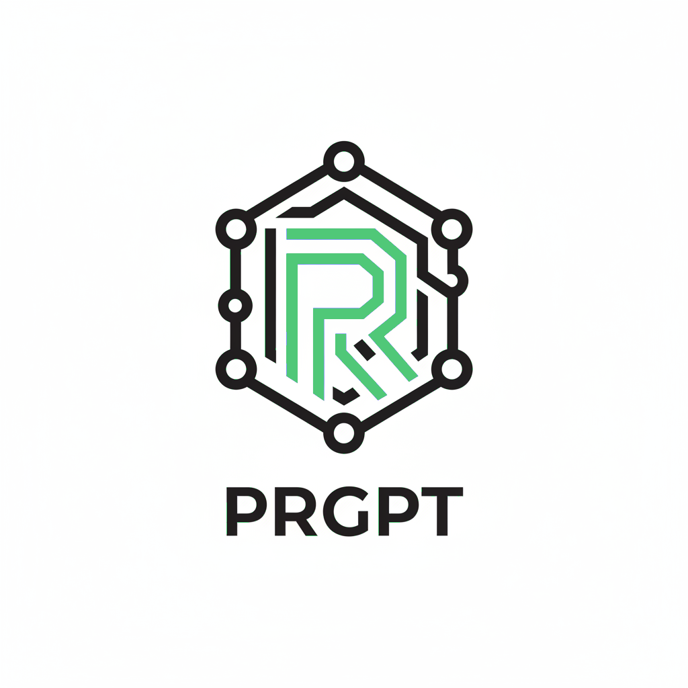
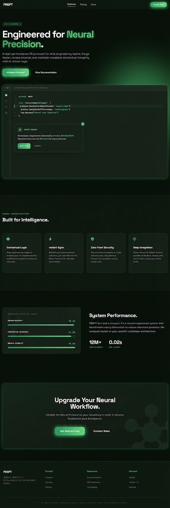

# PRGPT - AI-based PR reviewer and summarizer (Gemini Powered)

<p align="center">
  
</p>

[](https://opensource.org/licenses/MIT)

## Overview

PRGPT `ai-pr-reviewer` is an AI-based code reviewer and summarizer for GitHub pull requests using **Google Gemini 1.5** models. It is designed to be used as a GitHub Action and can be configured to run on every pull request and review comments.

<p align="center">
  
</p>

## Reviewer Features:

- **PR Summarization**: It generates a summary and release notes of the changes in the pull request.
- **Line-by-line code change suggestions**: Reviews the changes line by line and provides code change suggestions.
- **Continuous, incremental reviews**: Reviews are performed on each commit within a pull request, rather than a one-time review on the entire pull request.
- **Cost-effective and reduced noise**: Uses Gemini's large context window to provide comprehensive reviews while tracking changed files between commits.
- **"Light" model for summary**: Designed to be used with a "light" summarization model (e.g. `gemini-1.5-flash`) and a "heavy" review model (e.g. `gemini-1.5-pro`).
- **Chat with bot**: Supports conversation with the bot in the context of lines of code or entire files.
- **Smart review skipping**: By default, skips in-depth review for simple changes (e.g. typo fixes).
- **Customizable prompts**: Tailor the `system_message`, `summarize`, and `summarize_release_notes` prompts.

## Install instructions

PRGPT runs as a GitHub Action. Add the below file to your repository at `.github/workflows/prgpt.yml`

```yaml
name: Code Review

permissions:
  contents: read
  pull-requests: write

on:
  pull_request:
  pull_request_review_comment:
    types: [created]

concurrency:
  group:
    ${{ github.repository }}-${{ github.event.number || github.head_ref ||
    github.sha }}-${{ github.workflow }}-${{ github.event_name ==
    'pull_request_review_comment' && 'pr_comment' || 'pr' }}
  cancel-in-progress: ${{ github.event_name != 'pull_request_review_comment' }}

jobs:
  review:
    runs-on: ubuntu-latest
    steps:
      - uses: subhajit/prgpt@latest
        env:
          GITHUB_TOKEN: ${{ secrets.GITHUB_TOKEN }}
          GEMINI_API_KEY: ${{ secrets.GEMINI_API_KEY }}
        with:
          debug: false
          review_simple_changes: false
          review_comment_lgtm: false
```

#### Environment variables

- `GITHUB_TOKEN`: This should already be available to the GitHub Action environment. This is used to add comments to the pull request.
- `GEMINI_API_KEY`: use this to authenticate with Google Gemini API. You can get one from the [Google AI Studio](https://aistudio.google.com/app/apikey). Please add this key to your GitHub Action secrets.

### Models: `gemini-1.5-pro` and `gemini-1.5-flash`

Recommend using `gemini-1.5-flash` for lighter tasks such as summarizing the changes (`gemini_light_model` in configuration) and `gemini-1.5-pro` for more complex review and commenting tasks (`gemini_heavy_model` in configuration).

### Prompts & Configuration

See: [action.yml](./action.yml)

## Conversation with PRGPT

You can reply to a review comment made by this action and get a response based on the diff context. Additionally, you can invite the bot to a conversation by tagging it in the comment (`@prgpt`).

Example:

> @prgpt Please generate a test plan for this file.

### Ignoring PRs

To ignore a PR, add the following keyword in the PR description:

```text
@prgpt: ignore
```

## Contribute

### Developing

Install the dependencies:
```bash
$ npm install
```

Build the typescript and package it for distribution:
```bash
$ npm run build && npm run package
```

## Disclaimer

- Your code will be sent to Google's servers for processing.
- This action is not affiliated with Google or gemini api .
